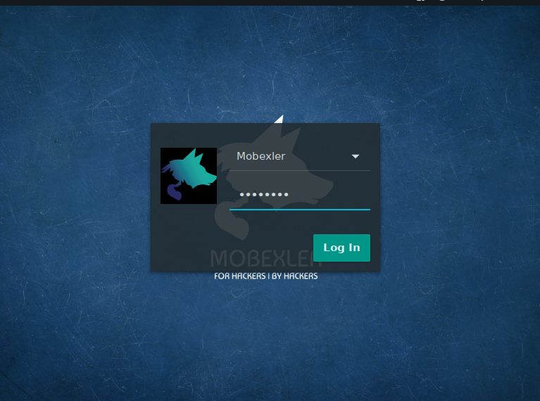
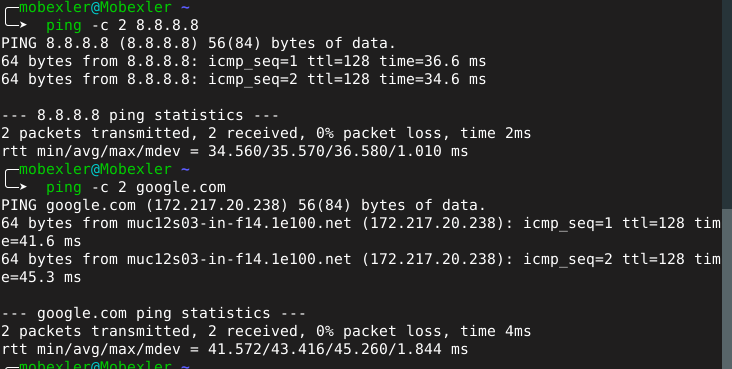
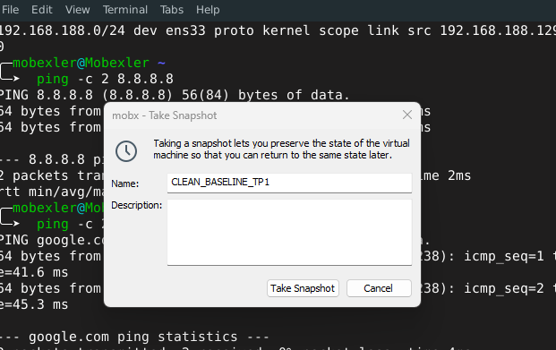

# TP — Mise en place de l’environnement Mobexler

##  Objectifs

* Démarrer Mobexler avec Internet (NAT)
* Configurer un réseau lab (Host-Only)
* Connecter une cible Android (ADB)
* Créer un snapshot CLEAN
* Documenter pour reproductibilité

#  1. Téléchargement Mobexler

* Télécharger le fichier `.ova`
* Vérifier le hash SHA256


#  2. Import de la VM

## Vmware

* File → Import Appliance → sélectionner `.ova`

## Configuration réseau

* Adapter 1 : NAT
* Adapter 2 : Host-Only


* Import OVA
* Settings réseau (NAT + Host-Only visibles)

---

# 3. Premier démarrage

* Lancer la VM
* Login :

  * username : mobexler (ou autre)
  * password : mobexler


* Écran de login
* Bureau ou terminal après connexion

---

# 🌐 5. Vérification réseau

## Commandes :

```bash
ip a
ip route
ping -c 2 8.8.8.8
ping -c 2 google.com
```

## Vérifications :

* IP NAT (Internet)
* IP Host-Only (lab)
* Route par défaut
* Ping OK



#  6. Snapshot CLEAN

## Création :

* Nom : CLEAN_BASELINE_TP1
* Description : environnement prêt



* Snapshot créé
* Liste des snapshots

---

